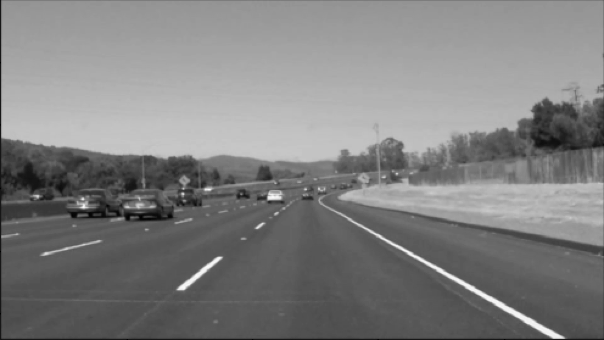
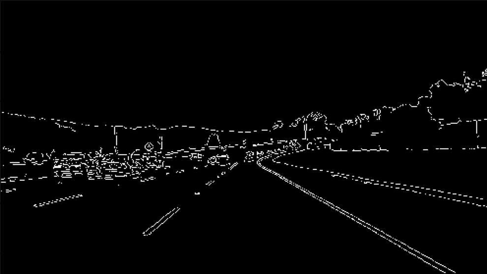
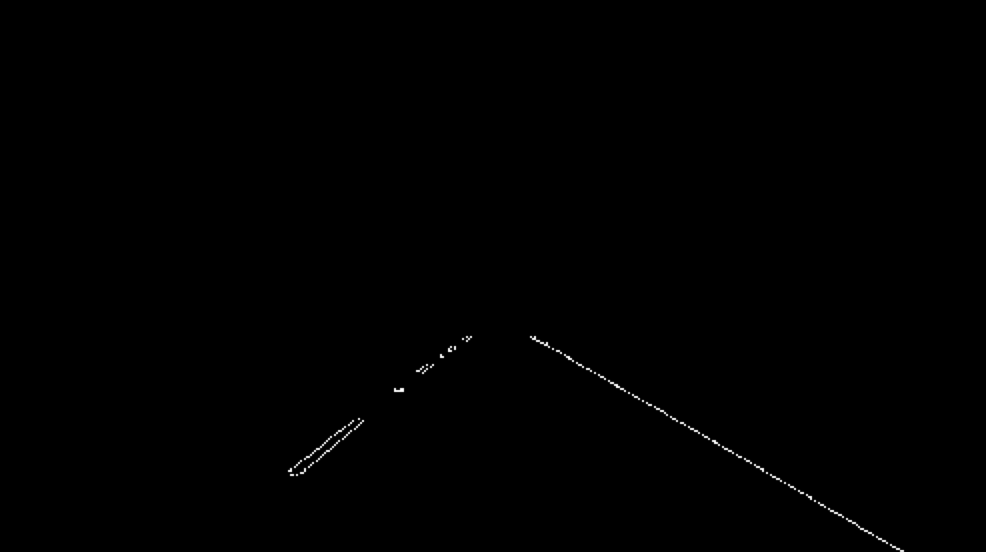
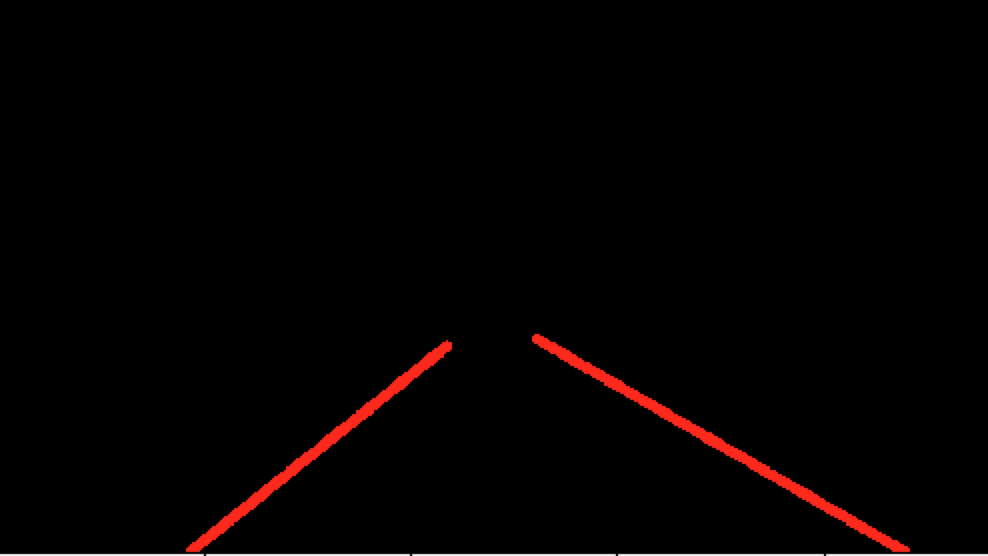
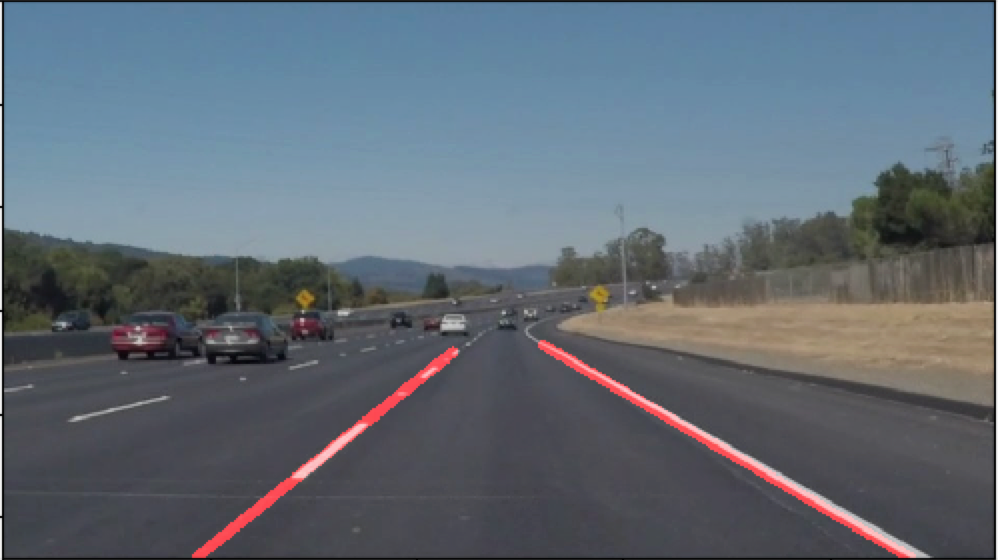
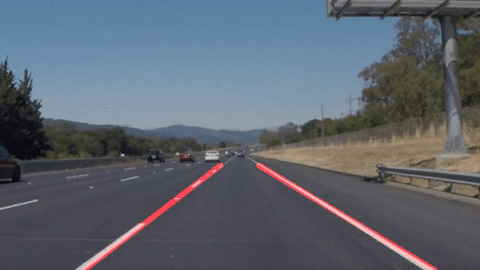

# **Finding Lane Lines on the Road** 

---

**Finding Lane Lines on the Road**

The goals / steps of this project are the following:
* Make a pipeline that finds lane lines on the road
* Reflect on your work in a written report


[//]: # (Image References)

[gray]: writeup_images/gray.jpg "Grayscale"

---

## Reflection

## 1. Pipeline Description:

    My pipeline consists of 8 steps
    
### Read in images from directory
There are 6 images in my test directory:
    solidWhiteCurve.jpg
    solidWhiteRight.jpg
    solidYellowCurve.jpg
    solidYellowCurve2.jpg
    solidYellowLeft.jpg
    whiteCarLaneSwitch.jpg

### Convert image to grayscale
Converting to grayscale simplifies edge location


    
### Smooth Image via Gaussian Blur: 
Canny edge detection already applies gaussian blurring, but we can have better control if we include it here (not sure this really helped


    
### Canny Edge Detection
This process identifies the distinct edges in our image



### Define a Polygon for Masking the Image:
We're only interested in the section of the image in front of the vehicle and within the lane boundaries.  I used the following vertices:

    POLY_LEFT_BOT=(160,540)                                                                                                          
    POLY_LEFT_TOP=(420,330)                                                                                                           
    POLY_RIGHT_TOP=(520,330)                                                                                                          
    POLY_RIGHT_BOT=(880,540)

### Apply Polygon as an Image Mask
By creating a filled polygon with the desired image, we can do a bitwise AND against the image from the canny edge detection step and extract only the areas of interest.



### Convert Masked Edges Using Hough Transform
I used a threshold of 20 votes, min_line_len of 15 and max_line_gap of 25 to get the Hough Transform of line points.

I then separate those points into two subgroups, based on slope of the line. I then find the topmost line segment in each group, average out the slope and the intersect to draw a straight line to the bottom of the image frame.



### Final result
Finally, I draw the hough lines (transparent) on the original image



## Details behind how lines were detected

### Tune the Hough Parameters
Using test images and manual tweaking, I came up with the settings I best felt isolated lane lines'.

### Finding Two Lane Lines

#### First and Failed Approach
At first, I created an array of line segments, sorted by slope.  I then iterated over those slopes looking for a difference in slope between the previous segment and current segment which was over some threshold.
This worked for the first image, but failed miserably for the rest. 

#### Second Approach (Improvements but failure)
I decided to attribute all negative slopes to the left side and all positive slopes to the right side. This kept any outliers or lane reflectors from screwing things up.
Next I found the distance of each line from the bottom of the frame and sorted by that. Finally, I elected to draw from the top of one line to the top of the next (to elminate the gaps). I also drew the last line by itself, and finally drew a line from the bottom of the last segment down to the bottom of the image frame (using the average slope of the side).
This produce jagged lines which looked awful.

#### Final Solution:

I sort each subset of line segments for each side by their distance from the bottom of the frame. I do this to find the topmost point.
I then get the average slope and average intercept (I started with mean, but outliers added noise. Median seemed to work the best in the video tests).
Using those averages, I introduce the y value of the bottom of my intercept and solve for x:

```x = int((-1 * (median_intercept/median_slope)) + (POLY_RIGHT_BOT[1]/median_slope))```

This allows me to draw one continual, smooth line.

###### Please check the test folders for the final results




### 2. Identify potential shortcomings with your current pipeline

The lines are still jumpy at times or reduce in size suddenly.

### 3. Suggest possible improvements to your pipeline

Maybe via machine learning, I can predict where the next frames line segments should be, based on the prior frames and averaging.
